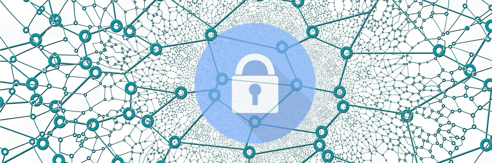

# Secure Neural Network for Images

Train neural network with the encrypted data. This repository is supposed to contain a Deep Neural Network architecture and an Encryption library. This Encryption library takes the image and produces a meshed up image/array, which cannot be recovered. Train the Neural Network with this encrypted image. DNN would still be able to learn under these images and it would successfully classify the images. As the images cannot be recovered this algorithm is supposed to be privacy-preserving. [Note: This project is a part of my ongoing research on privacy-preserving Deep Learning Models under the supervision of **Prof. Avishek Adhikari**, Presidency University, Dept. of Mathematics, Kolkata.]

## Building The Project
Please use **cmake** to compile the project. It would create a bunch of dynamically linkable libraries along with the main file (which is for testing purposes). 
### Note: 
Include MathCal.h in the main file as it contains the initial seeds. Otherwise generated random numbers inside the random matrix would have same sign for all. Due to this reason the model would not learn.

## To Do:
1. Identify why it is not learning.
2. Fix the learning issue.
3. Complete the encryption algorithm.
4. (Possibly ) add a network visualization tool.
5. Verify whether the _Accuracy function is working as expected.
6. Verify whether Matrix operations are working as expected. :heavy_check_mark: 
7. Verify whether BackPropagation is working properly. (Confirm any calculation or overflow error)
8. Parallelize NeuralNetwork (possibily with pthread or fork).
9. Solve any memory issues.
10. Change Random Number Generator.
11. Investigate why learning is being stoped after some steps.

## Problems:
1. Sometimes learning sometimes it is not learning.
2. Learning stoped after some steps.